# hcd
dit is de repo voor het vak human centered design.

## inhoudsopgave
1. [marie](#marie)
2. [concept](#concept)
3. [prototypes](#prototypes)
4. [schetsen & notities](#schetsen-notities)
5. [design principles](#design-principles)
6. [reflectie](#reflectie)

## marie
de case die ik mag gaan onderzoeken is die van marie. ik heb samen met mijn groepje vragen opgesteld en daar is een leuk en interessant gesprek uitgekomen. dit zijn de notities die ik daarbij heb gemaakt.

- doof geboren
- podcasts zijn extreem ontoegankelijk, transcripts zijn kut, alles is saai, niks is goed AAAAH
- genres: scifi, kookprogramma's, thriller, misdaad
- films en series die zij goed vindt: great british bake off, 3 body problem, the bear, rupaul, the menu, the chestnut man, DUNE, queer eye
- cc is GREAT maar soms niet beschikbaar, en kan soms wel echt uitgebreider.
- intonatie, manier van spreken, emotie gaat verloren.
- waar komt geluid vandaan -> klop klop ?????? (animaties?)
- 'spannende muziek' wat de fok is dat
- consistency is key! niet te veel doen. leidt af van de inhoud. (misschien in eerste ontwerp nog wel want crazytimes maar in final design doe ff rustig)
- zinnen die niet worden afgemaakt bestaat niet in subtitles.
- nuance mist, bijv bij queer eye. yas queen ?!
- wie is iemand? hoe komt die over?
- podcasts die ze interessant zou kunnen vinden: designproblems, omdenken
- 'de dodo' -> dierenfilmpjes!!! gaan creatief om met de geluiden die dieren maken
- kut aan podcasts: kom tot de kern. als ze een pc kijkt -> 4xspeed omdat het zo rete lang duurt voordat ze bij de kern komen.
- muziek is een totaalbeleving, draagt bij aan sfeer. maar dat lukt niet. (funeral song, iedereen huilen)

ook heb ik me laten tippen door vasilis dat hij een podcast aflevering met marie had gemaakt. het leek me waardevol om daar even doorheen te gaan om nog wat meer informatie over haar te bemachtigen. dit zijn quotes die ik uit het transcript heb gehaald.

> Ik denk dat beeld taal sterker maakt maar andersom ook. Dus dat vond ik een interessante combinatie.

> Ik vind het prima om dingen te lezen. Ik vind om te lezen leuk, ik lees ook veel boeken. Maar wel dat je zelf kan kiezen of zelf kan bepalen hoe je informatie krijgt. Ik kan dingen lezen. Maar als je een klein dingetje nodig hebt uit een stukje informatie uit een hele lange tekst. 

> Die hadden een animatie erbij. Zo’n klein balletje wat dan zo over je scherm zo in de winkelwagen terechtkomt. Dat soort kleine details die helpen volgens mij enorme bij gebruiksvriendelijkheid. 

> En ik heb dat nooit geweten totdat iemand mij vertelde dat, dat, dat, dat, dat maakt geluid. Dat was echt een hele nieuwe wereld voor mij. Dat ik echt dacht van oh wauw. Maar als gebarentaal de voertaal zou zijn dan denk ik zeker dat de wereld gewoon visueler ingericht zou zijn in plaats van auditief. Dan zouden er heel veel lampjes zijn, flitssystemen, […] ja je kan een week thuis zitten met iets wat piept en het gewoon niet door hebben.

> Als gebarentaal de voertaal zou zijn dan zou de wereld gewoon visueler ingericht zijn. Als de waterkoker bijna droog kookt dan piept hij. Ik kan een week thuis zitten met iets wat piept en het gewoon niet door hebben.

> Ja, je hebt het mij ook gevraagd en ik heb er even naar gekeken. En ik dacht het is wel een grote lange lap tekst, ja. En ik heb daar wel over nagedacht. Ik denk dat het voor doven, ja het is natuurlijk moeilijk om te lezen sowieso, maar ik denk voor de gemiddelde mens geldt hetzelfde, gesproken taal heeft een bepaalde intonatie, een bepaalde nuance en die zie je in die tekst niet terug. En ik denk ook dat ja als mensen praten dan maken ze hun zin niet af, spontaan taalgebruik, of je springt over naar een ander idee. En dan merk je in zo’n transcriptie vaak dan staat er een punt en dan komt er weer een nieuwe zin. Maar zo werkt het niet, dat is hier niet zo. Dus waar begint het en waar eindigt het, ja dat is helemaal niet […] dat is heel lastig om ontspannen te lezen want je moet zelf gaan denken van nou ja waar is het eind. Dus ik denk voor de gemiddelde dove […] maar voor mij voor de eerste keer […] het eerste transcript wat ik las dacht ik van nou dat was best wel moeilijk. Je moet wel focussen. Nu gaat het wel beter. Maar wat wel goed helpt inderdaad is dat je kan zien wie wat zegt want dat kunnen we ook niet horen bijvoorbeeld. Ja.

en nog 1 quoteje van vasilis: 
> Veel ontwerpers ontwerpen stiekem voor zichzelf.

## concept
ik wil me graag focussen op podcasts, omdat ik het doodzonde vind dat deze volledig ontoegankelijk zijn. ik wil kijken hoe ik er alsnog een leesbaar ding van kan maken waarin de algemene vibe toch nog behouden wordt. een gesprek IS namelijk niet hetzelfde als een artikel - er praten 2 mensen tegen elkaar en die dynamiek maakt een podcast ook een podcast. ik wil dus dat het makkelijk leesbaar en te begrijpen is, en daarin de dynamiek en toon tussen de hosts behouden.

marie had benoemd dat ze - als ze podcast content kon consumeren - zou kiezen voor de 'omdenken' podcast of voor een podcast over design problemen. ik heb dus gekozen voor de aflevering 'Should we take the hamburger off the menu?' van de podcast Web Materials.

### feedback op concept (eric)
eric is vooral heel benieuwd naar hoe ik van plan ben om dit te gaan doen. ik moet zeggen dat ik dat zelf ook wel ben.

## prototypes

### versie 1
dit is mijn eerste versie van de visualisatie van de podcast:

ze vond de hoofdjes leuk.

ze zei letterlijk: 'hier haak ik al af. blijkbaar is vasilis lang van stof.' ik moet dus een manier vinden om wat meer ruimte in het verhaal te creëren.

dit stukje vond ze wel nice, maar ze begreep niet meteen dat de gele kleur 'vrolijk' moest betekenen. ook lachen de poppetjes hierna, en vond ze het niet duidelijk wanneer er nou precies gelachen werd.

dit vond marie wel een goed voorbeeld van hoe tekst leesbaarder is. ze kon niet goed begrijpen dat dat beginstukje sarcastisch gezegd werd, dus daar moet ik nog iets op bedenken. misschien iets met quotation marks of zoals die spongebob meme DiE zO PrAaT. Of gewoon '[sarcastisch]' zoals in CC gedaan zou worden.

#### feedback

waar ik me op ga focussen voor volgende week is het volgende:
- leespunt moet ongeveer in het midden van het scherm en moet aangegeven worden d.m.v. iets visueels. zo weet je waar je 'hoort te zijn' en maken de lachende emojis bijv. meer sense.
- sarcastische toon aanpassen
- meer witruimte en rust toevoegen in de grote lappen tekst.
- meer emoties in de emojis. (neutrale gezichts uitdrukking, misschien wenkbrauwtjes toevoegen ofzo (kan veel emotie overbrengen maar ik wil het liever dmv tekst doen eigenlijk))
- dit stuk herschrijven (want heel raar als je het leest en niet dit soort spreektaal gewend bent): Do I want the navigation itself to be at the top? (Which I think is a silly idea) Do I want to put it in the footer? (Which I think is an okayish idea) Do I want to make an extra page where I actually spend some time on the navigation, and give it the attention that it needs? That might be the best idea: to make a navigation page. This would create room to add some explanation to what the clickable links actually are and what they lead to.

#### gesprek tamara 11 april

tamara zei dat ze een andere, meer verhalende podcast zou kiezen zodat ik ook dingen kon doen met bijv. geluidjes die het verhaal aansterken. ik heb alleen heel bewust de keuze gemaakt om te luisteren naar marie en haar wensen. zij vertelde dat ze graag naar een podcast over design problems of omdenken zou luisteren, als dit mogelijk zou zijn.

ik weet dus niet zo goed of ik hier iets mee kan, en ik heb ook de fb van marie zelf nog niet kunnen verwerken.

#### voortgangsgesprek 12 april (vasilis)

vasilis had nog een leuk idee om toe te voegen, wat eigenlijk wel aansloot op wat tamara gisteren had gezegd. ik kan een soort van geluidjes 'faken' die dan bij het verhaal passen, en die met illustraties oid toevoegen.

### versie 2

#### feedback
- veel beter leesbaar dan vorige week
- de hierarchie in de 'hahaha' kan beter
- de poppetjes moeten wat meer op de leeslijn zitten
- secondary text is beetje raar, misschien gewoon weghalen ('waarom is de ene tekst belangrijker dan de andere?')
- de link lijkt nu bizar belangrijk terwijl dat echt wel mee valt

## schetsen-notities
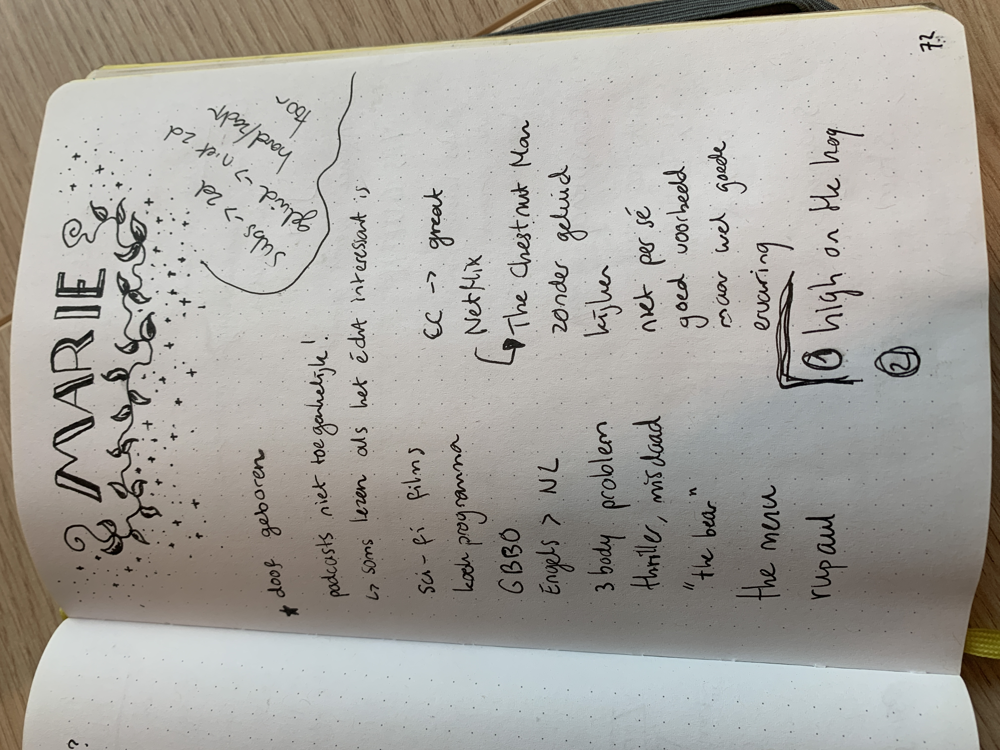
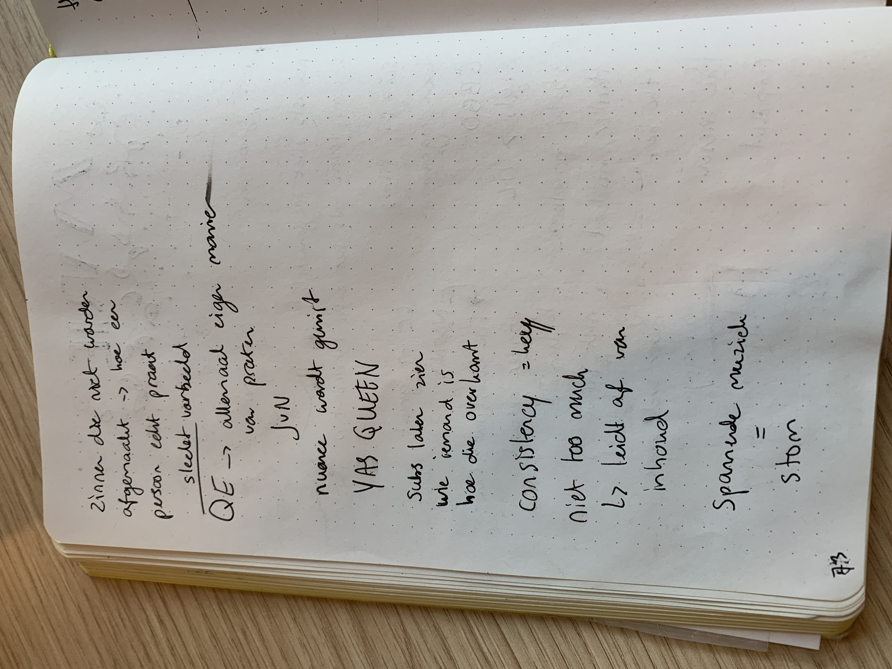

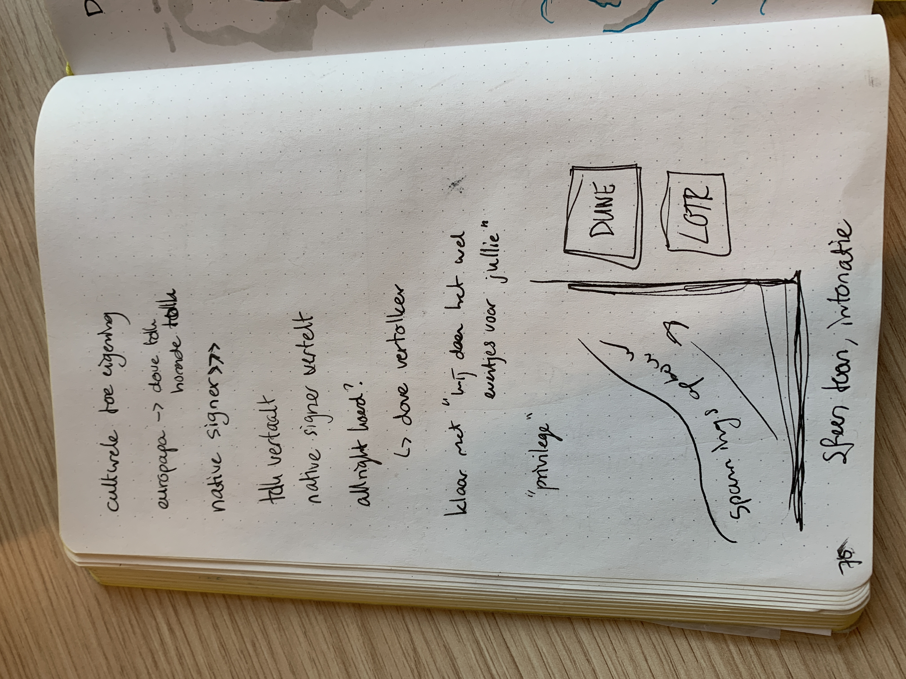
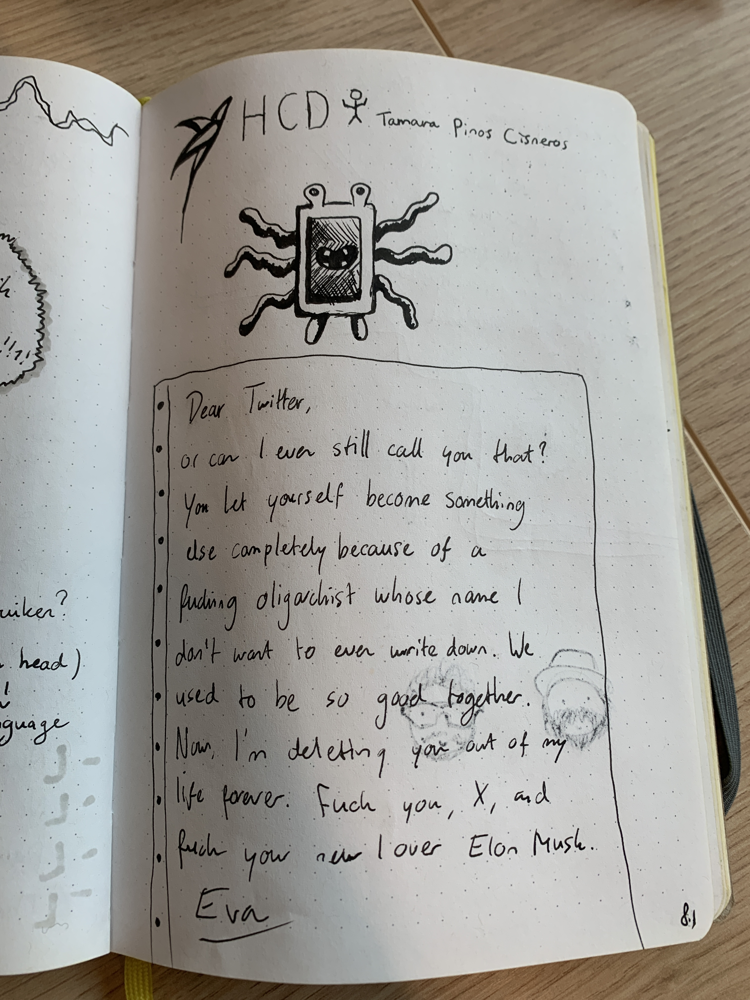
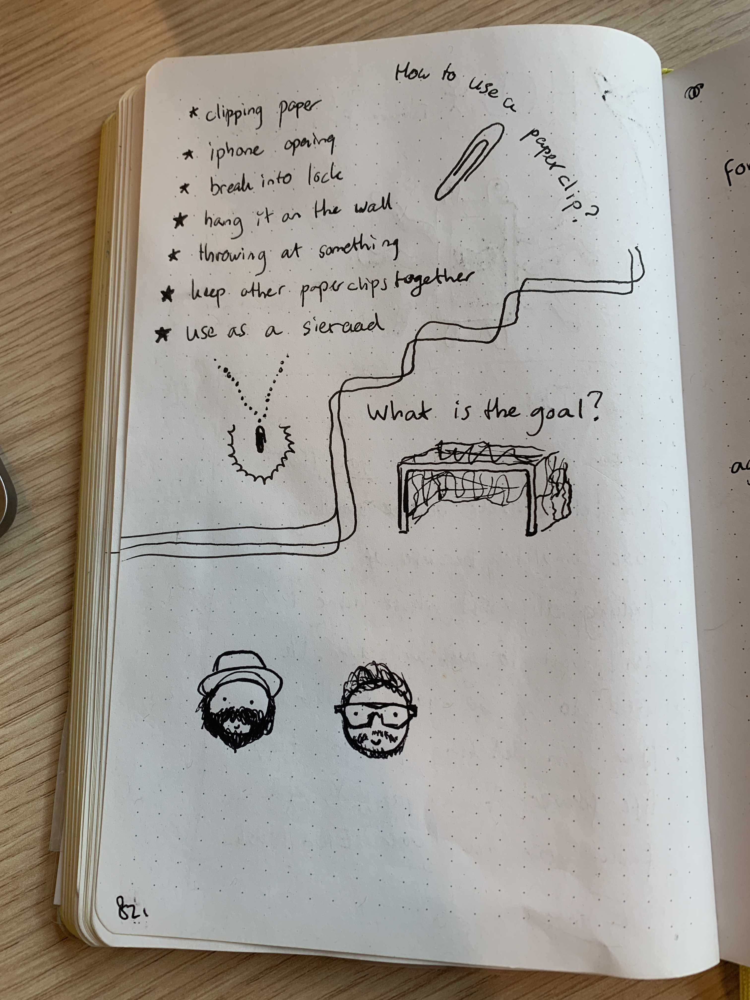
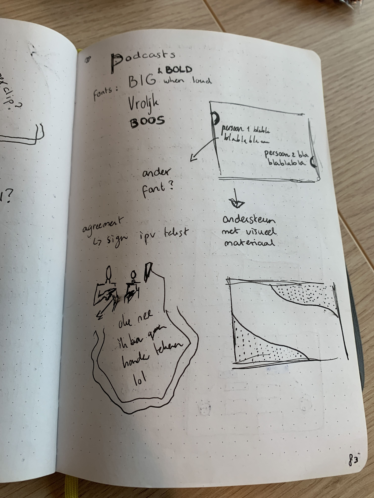
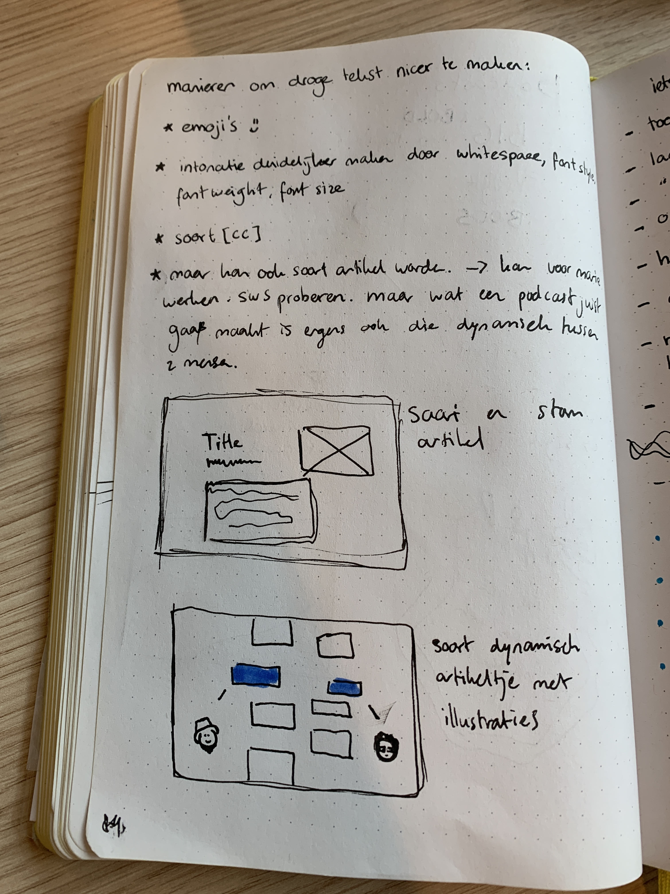
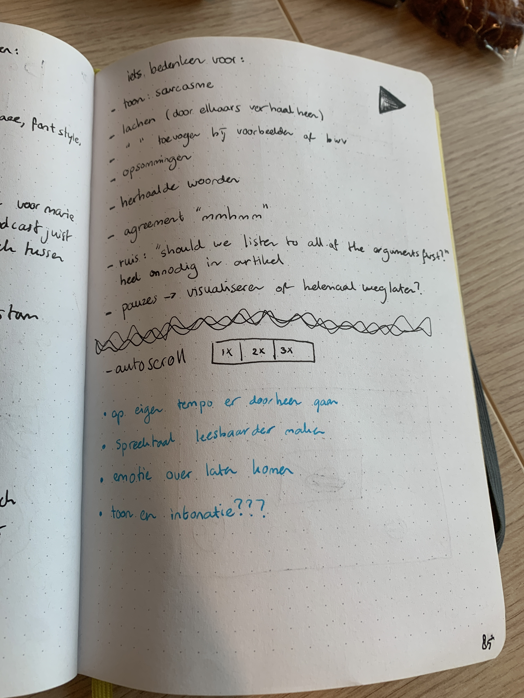
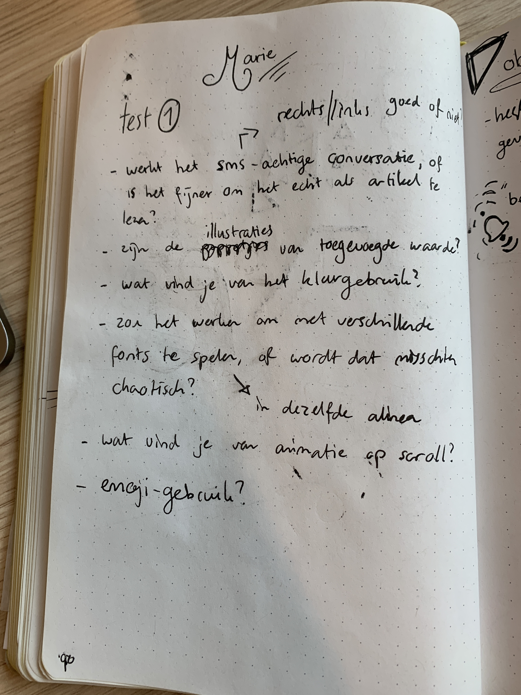
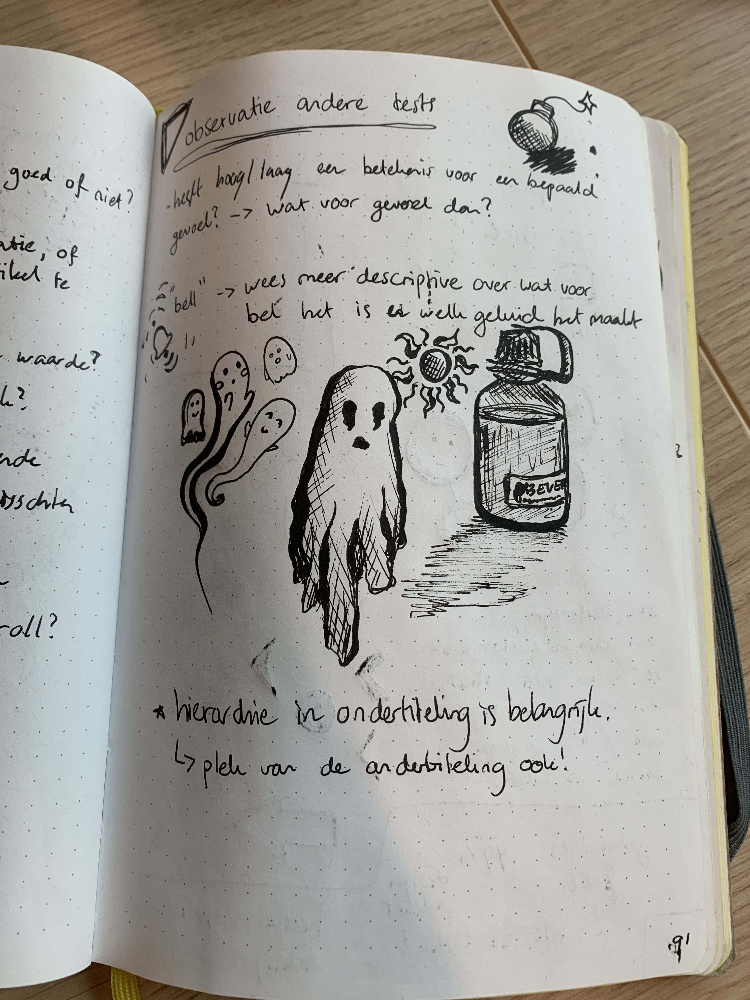
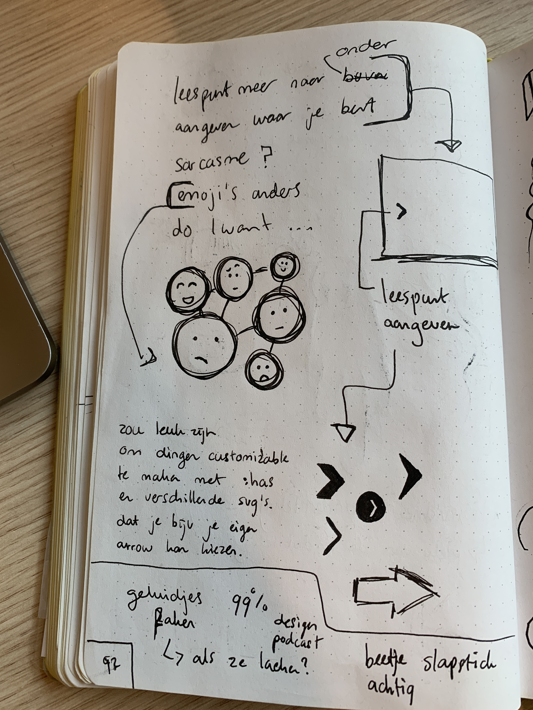
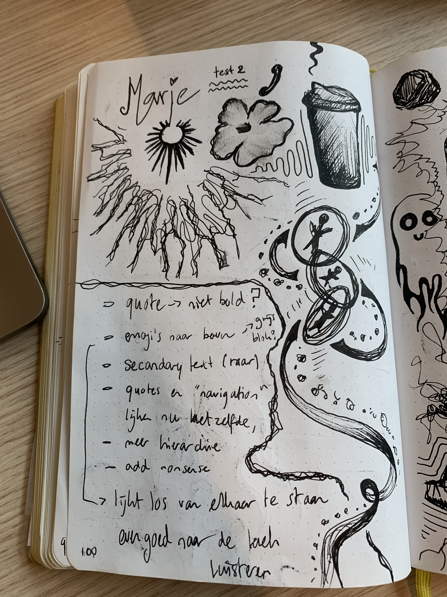
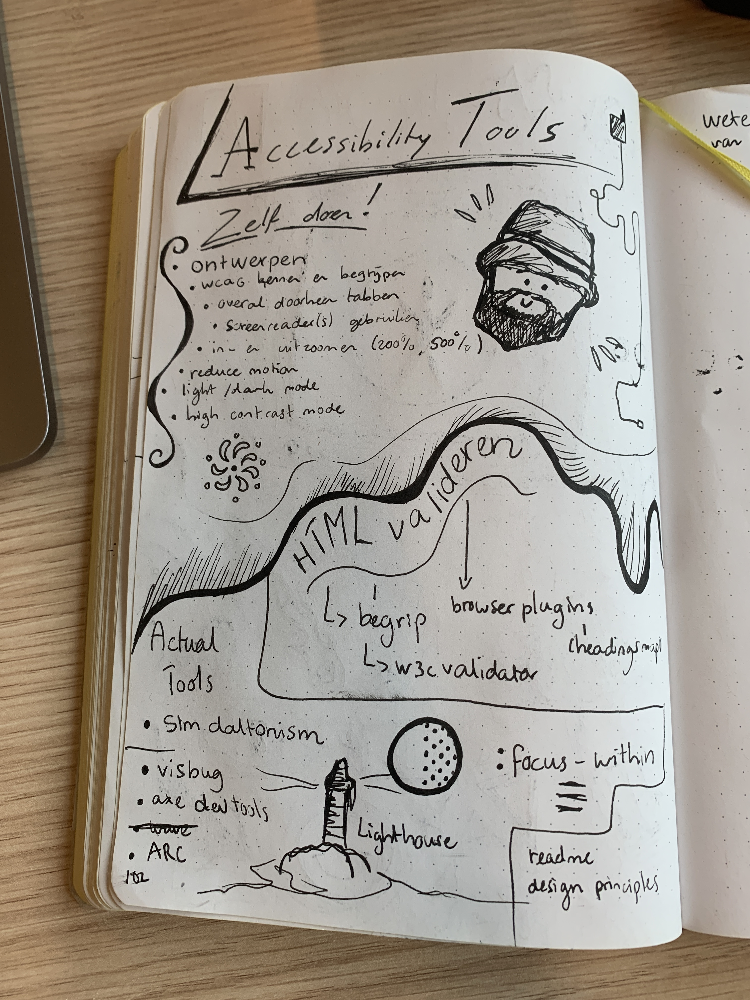

## design-principles
### study situation
aan het begin van dit vak hebben we natuurlijk uitvoerig de situatie bestudeerd met marie, door het 'interview' (meer een gesprek) en wat meer research naar de doven community. hier bleef het niet bij, want bij elke testdag kwam ik weer achter nieuwe dingen door hoe marie naar bepaalde dingen in mijn project, maar ook de andere projecten keek. Dit was heel leerzaam, vond ik.

### ignore convention
ik denk dat ik door mijn keuze voor een podcast al buiten de hokjes probeerde te denken, voor zover ik weet bestaat er namelijk niet zoiets als wat ik probeerde te maken.

### prioritise identity
ik heb geprobeerd mijn eigen visuele identiteit door te laten schemeren dmv illustraties. ook probeerde ik door middel van font en kleur de identiteit van vasilis en espen door te voeren.

### add nonsense
ik heb wel wat geinige dingetjes in het project gestopt, zoals de lachende poppetjes en het vogeltje aan het begin. ik had het leuk gevonden om nog meer nonsense toe te voegen, om bijv meer illustraties toe te voegen die fake sounds zouden moeten simuleren.

## reflectie
ik vond dit project ontzettend cool. ik baal ervan dat ik niet meer tijd had om erin te steken, omdat ik denk dat het project veel meer potentie had dan wat ik ervan heb kunnen maken. het lijkt me gaaf om in de toekomst ooit nog eens terug te komen naar een soortgelijk project, maar dan misschien met een meer verhalende podcast met geluidseffecten. daar valt nog wel veel te halen qua uniqueness.

ik denk dat dit vak heel belangrijk is. het is echt een unieke ervaring om te ontwerpen voor 1 persoon, vooral iemand met een beperking. misschien zou het wel tof zijn om studenten zich te laten inschrijven bij een case. ik heb toevallig de case gekregen die mij het meest prikkelde, maar ik ben overall niet echt fan van random indelingen. maar dat is eigenlijk het enige dat ik aan te merken heb.

## bronnenlijst
main source: 
- https://webmaterials.design/posts/05-should-we-remove-the-hamburger/

other sources:
- https://stackoverflow.com/questions/5681481/should-ol-ul-be-inside-p-or-outside
- https://jakearchibald.github.io/svgomg/
- https://scroll-driven-animations.style/tools/view-timeline/ranges/#range-start-name=cover&range-start-percentage=0&range-end-name=contain&range-end-percentage=30&view-timeline-axis=block&view-timeline-inset=0&subject-size=smaller&subject-animation=reveal&interactivity=clicktodrag&show-areas=yes&show-fromto=yes&show-labels=yes
- https://developer.chrome.com/docs/css-ui/scroll-driven-animations
- https://scroll-driven-animations.style/
- https://www.w3schools.com/cssref/css_colors.php
- https://www.w3schools.com/howto/howto_css_text_selection.asp
- https://css-tricks.com/almanac/selectors/s/selection/
- https://www.msudenver.edu/wp-content/uploads/2021/09/Best-Practices-for-Writing-Closed-Captions.pdf
- https://stackoverflow.com/questions/61771309/pixel-art-style-border-on-tumblr-theme
- https://codepen.io/shooft/pen/KKYbBMa
- https://gsap.com/docs/v3/Plugins/DrawSVGPlugin
